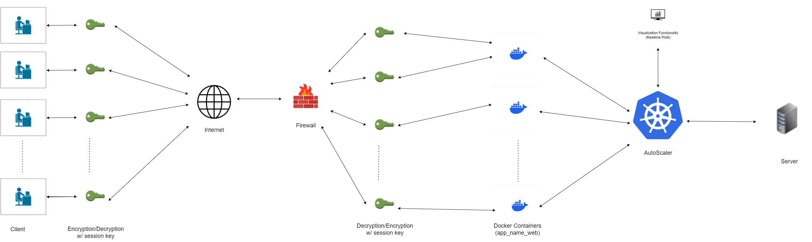
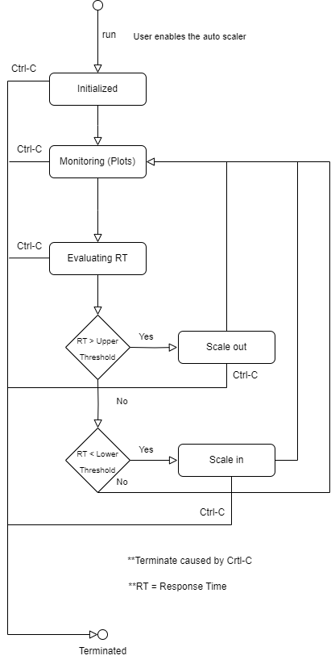
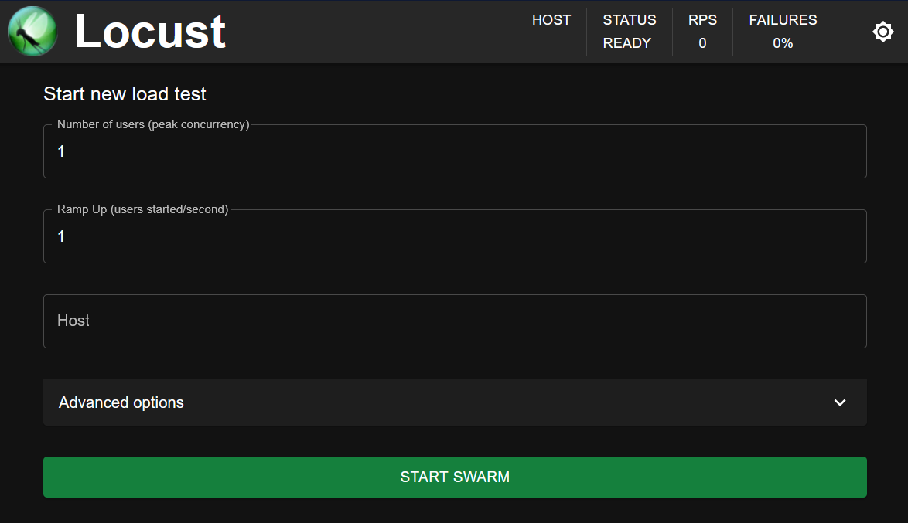

# Docker Swarm Autoscaler



# Swarm Setup
### 1. create 2 VMs (linux based images)
open the following TCP ports: ```22``` (ssh), ```2376``` and ```2377``` (swarm), ```6379``` (redis), and any other ports for visualizations or a webapp
### 2. install Docker on both
```
$ sudo apt update
$ sudo apt -y install docker.io
```
### 3. create a swarm cluster on these VMs, with 1 manager and 1 worker (add as many workers as desired)
#### manager:        
```
$ sudo docker swarm init
```
> this produces an output with a token in the following format for its workers
```
--token xxxxxxxxxxxxxxxx <swarmmanagerip>:2377
```
--
#### workers:
> copy the managers token and paste it in this format
```
$ docker swarm join --token ...
```
--
#### lastly, on manager:
> deploy the app
```
$ sudo docker stack deploy --compose-file docker-compose.yml app_name
```
> to see current containers
```
$ docker service inspect app_name --pretty
```


#### NOTE: in case of any unexpected errors, these cmds may prove useful:
```
$ sudo groupadd docker
$ sudo usermod -aG docker $USER
$ newgrp docker
```

# State Diagram




# AutoScaler set up:
### 1. ssh into the swarm manager and configure the environment
> pip installs:
```
$ pip install matplotlib, locust, requests, docker, datetime
```
### 2. execute autoscaler.py


# Setting up users / testers:

## VM-based:
> configure it to be a client that executes http_client.py
```
$ sudo apt -y install python-pip
$ pip install requests
```
> to execute:
```
$ python3.8 http_client.py <ip> <users> <requestdelay>
```

## Locust-based:
> while ssh'd into the swarm manager, open a terminal in the proj directory
```
$ locust -f locustfile.py
```
> open the web interface shown in the output


> set any desired load test


### Enjoy :)

